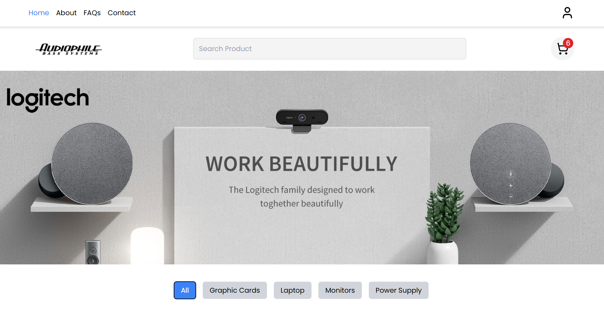

# 🛒 E-Commerce Website

A modern and fully responsive **E-Commerce web application** built with **React.js** and **Tailwind CSS**, focusing on clean UI, smooth user experience, and scalable front-end architecture.

---

## 🌐 Live Demo

🔗 [View Live Demo on Vercel](https://e-commerce-web-three-beryl.vercel.app/)

---

## 📸 Screenshots

## 

---

## ✨ Features

- 🛍️ Product listing with clean UI
- 🛒 Shopping cart with quantity management
- 🧾 Checkout page with form validation
- 🧮 Order summary & invoice view
- 🗑️ Clear cart after successful order
- 📄 Static pages:
  - Home
  - About
  - FAQs
  - Contact
- 🎯 Active page focus & navigation state
- 🌗 Responsive design (Mobile / Tablet / Desktop)

---

## 🛠️ Technologies Used

- **React.js** (Create React App)
- **Redux Toolkit** – state management
- **React Router DOM** – routing
- **Tailwind CSS** – styling
- **Lucide Icons**
- **LocalStorage** – cart persistence

---

## 📦 Project Structure

src/
│── components/
│ ├── Navbar
│ ├── Footer
│ └── UI Components
│
│── pages/
│ ├── Home
│ ├── About
│ ├── FAQs
│ ├── Contact
│ ├── Cart
│ └── Checkout
│
├─ index.css
├─ App.jsx
└─ main.jsx

---

## 🚀 Getting Started

### 1️⃣ Clone the repository

```bash
git clone https://github.com/aliasaad01/E-commerce-Website-React.js-Tailwind-CSS.git

npm install
npm start
http://localhost:3000

---

📌 Notes

- This project focuses on Front-End architecture and UI/UX.
- Authentication and payment gateways can be added later (e.g. Firebase, Stripe).
- Built as a scalable base for real-world e-commerce applications.

---

## 👨‍💻 Author

**Ali Asaad**

Front-End Developer | React.js

- GitHub: [https://github.com/aliasaad01](https://github.com/aliasaad01)

- ⭐ If you like this project, give it a star!
```
